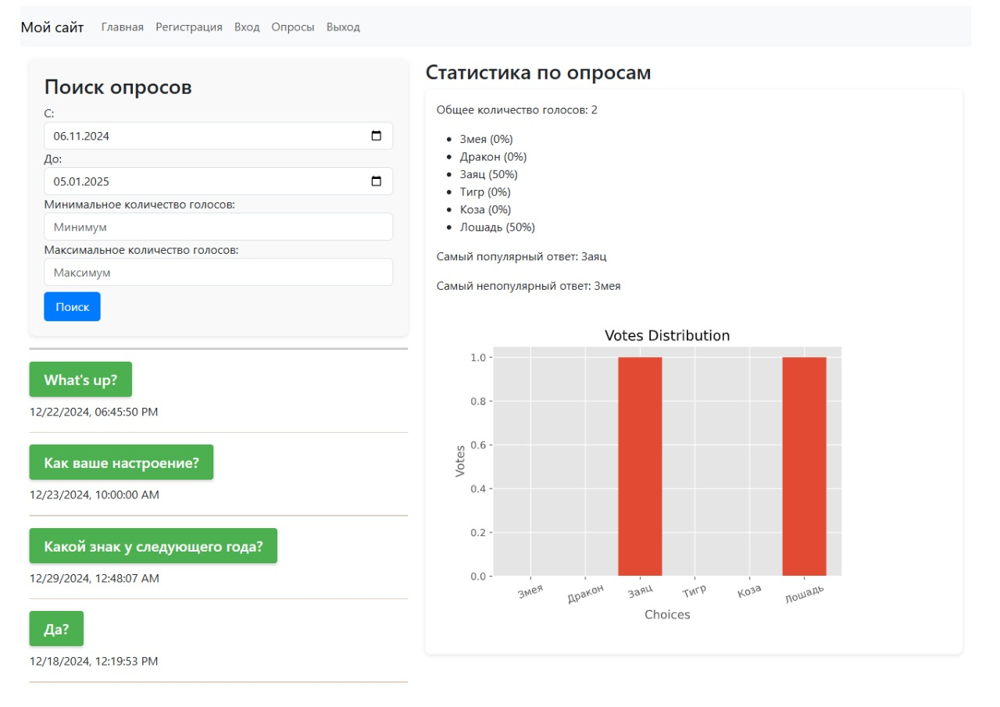
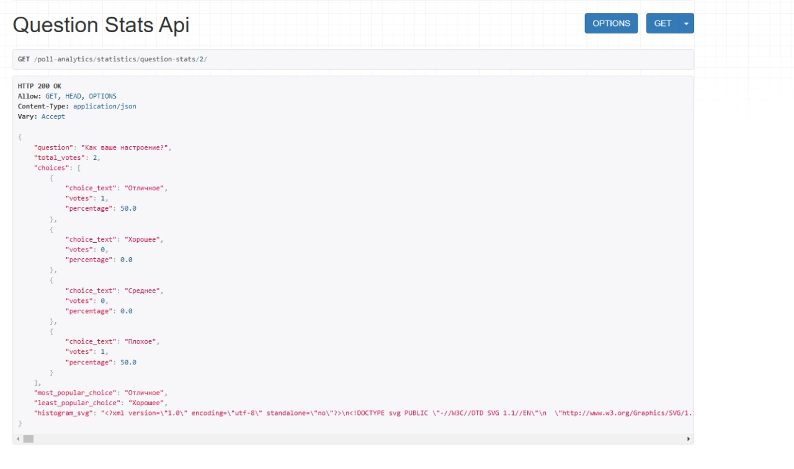

# Лабораторная работа №5. Django REST Framework: (микро)сервисы

Микросервисы со статистикой работают по 3 основным путям:

http://127.0.0.1:8000/poll-analytics/statistics/ - главная страница статистики
http://127.0.0.1:8000/poll-analytics/statistics/question-stats/<int:pk>/ - статистика по вопросу
http://127.0.0.1:8000/poll-analytics/export/ - скачивание данных в формате .csv

Пример работы:






Основные файлы:

'poll_analytics/views.py': 
```python
from datetime import datetime, timedelta
import io
import csv
import matplotlib
import matplotlib.pyplot as plt
from django.utils import timezone
from django.db.models import F, Sum
from django.shortcuts import get_object_or_404, render, redirect
from django.http import HttpResponseRedirect, JsonResponse, HttpResponse
from django.urls import reverse
from django.views import View, generic
from rest_framework.views import APIView
from rest_framework.response import Response
from rest_framework import parsers, status
from polls.models import Question, Choice
from .serializers import QuestionSerializer

matplotlib.use('Agg')

class QuestionView(APIView):
    parser_classes = (parsers.JSONParser,)

    def post(self, request, format=None):
        request_data = request.data
        date_range_provided = ('publication-dates' in request_data) and \
                              ('from' in request_data['publication-dates'] and 'to' in request_data['publication-dates'])

        if date_range_provided:
            publication_dates = request_data['publication-dates']
            date_from = datetime.strptime(publication_dates['from'], '%Y-%m-%d').replace(hour=0, minute=0, second=0)
            date_to = datetime.strptime(publication_dates['to'], '%Y-%m-%d').replace(hour=23, minute=59, second=59)
        else:
            date_now = timezone.now()
            date_from = (date_now - timedelta(days=60)).replace(hour=0, minute=0, second=0)
            date_to = date_now.replace(hour=23, minute=59, second=59)

        votes_range = request_data.get('votes-range', {})
        min_votes = votes_range.get('min', 0)
        max_votes = votes_range.get('max', float('inf'))

        questions = Question.objects.filter(pub_date__range=[date_from, date_to])
        questions = questions.annotate(total_votes=Sum('choice__votes')).filter(
            total_votes__gte=min_votes,
            total_votes__lte=max_votes
        )

        question_serializer = QuestionSerializer(questions, many=True)

        response_data = {
            'publication-dates': {
                'from': date_from,
                'to': date_to
            },
            'questions': question_serializer.data
        }

        return Response(response_data, status=status.HTTP_200_OK)

class QuestionStatsAPIView(APIView):
    def get(self, request, pk):
        try:
            question = Question.objects.get(pk=pk)
        except Question.DoesNotExist:
            return Response("Question does not exist", status=status.HTTP_404_NOT_FOUND)

        choices = question.choice_set.all()
        total_votes = sum(choice.votes for choice in choices)

        stats = {
            'question': question.question_text,
            'total_votes': total_votes,
            'choices': []
        }

        for choice in choices:
            choice_percentage = (choice.votes / total_votes * 100) if total_votes > 0 else 0
            stats['choices'].append({
                'choice_text': choice.choice_text,
                'votes': choice.votes,
                'percentage': round(choice_percentage, 2)
            })

        most_popular_choice = max(choices, key=lambda choice: choice.votes)
        least_popular_choice = min(choices, key=lambda choice: choice.votes)

        stats['most_popular_choice'] = most_popular_choice.choice_text
        stats['least_popular_choice'] = least_popular_choice.choice_text

        fig, ax = plt.subplots()
        plt.style.use('ggplot')
        ax.bar([choice.choice_text for choice in choices], [choice.votes for choice in choices])
        plt.xticks(rotation=20)
        plt.xlabel('Choices')
        plt.ylabel('Votes')
        plt.title('Votes Distribution')
        plt.subplots_adjust(bottom=0.2)
        buffer = io.BytesIO()
        plt.savefig(buffer, format='svg')
        plt.close(fig)
        buffer.seek(0)

        stats['histogram_svg'] = buffer.getvalue().decode()

        return Response(stats)

class ExportDataView(APIView):
    def get(self, request, format=None):
        questions = Question.objects.all()
        response = HttpResponse(content_type='text/csv')
        response['Content-Disposition'] = 'attachment; filename="polls_data.csv"'

        writer = csv.writer(response)
        writer.writerow(['Question', 'Choice', 'Votes'])

        for question in questions:
            for choice in question.choice_set.all():
                writer.writerow([question.question_text, choice.choice_text, choice.votes])

        return response

class StatisticsView(View):
    def get(self, request, *args, **kwargs):
        context = {'message': 'Привет, это GET-запрос!'}
        return render(request, 'poll_analytics/statistics.html', context)

    def post(self, request, *args, **kwargs):
        context = {'message': 'Привет, это POST-запрос!'}
        return render(request, 'poll_analytics/statistics.html', context)

def vote(request, question_id):
    question = get_object_or_404(Question, pk=question_id)
    try:
        selected_choice = question.choice_set.get(pk=request.POST["choice"])
    except (KeyError, Choice.DoesNotExist):
        return render(
            request,
            "polls/detail.html",
            {
                "question": question,
                "error_message": "You didn't select a choice.",
            },
        )
    else:
        selected_choice.votes = F("votes") + 1
        selected_choice.save()
        return HttpResponseRedirect(reverse("polls:results", args=(question.id,)))
```

Шаблон статистики 'Statistics.html':

```html




<style>
a.poll-link:link, a.poll-link:visited {
    background-color: #4CAF50;
    color: white;
    padding: 12px 20px;
    text-align: center;
    text-decoration: none;
    display: inline-block;
    border-radius: 4px;
    box-shadow: 0 2px 4px rgba(0, 0, 0, 0.2);
}
a.poll-link:hover, a.poll-link:active {
    background-color: #45a049;
}

hr.date-divider {
    height: 3px;
    background-color: #333;
    border: none;
}

hr.poll-divider {
    height: 1.5px;
    background-color: #8B4513;
    border: none;
}

.search-panel {
    background-color: #f9f9f9;
    padding: 20px;
    border-radius: 8px;
    box-shadow: 0 2px 6px rgba(0, 0, 0, 0.1);
}

.chart-container {
    background-color: #fff;
    padding: 15px;
    border-radius: 8px;
    box-shadow: 0 2px 6px rgba(0, 0, 0, 0.1);
}

.btn-search {
    background-color: #007bff;
    color: white;
    border-radius: 5px;
    padding: 8px 16px;
    border: none;
}

.btn-search:hover {
    background-color: #0056b3;
}
</style>

<div class="container">
    <div class="row">
        <div class="col-md-5">
            <div class="search-panel">
                <h3>Поиск опросов</h3>

                <div class="form-group">
                    <label for="from-date">С:</label>
                    <input type="date" class="form-control" id="from-date" required>
                </div>
                <div class="form-group">
                    <label for="to-date">До:</label>
                    <input type="date" class="form-control" id="to-date" required>
                </div>
                <div class="form-group">
                    <label for="min-votes">Минимальное количество голосов:</label>
                    <input type="number" class="form-control" id="min-votes" placeholder="Минимум" min="0">
                </div>
                <div class="form-group">
                    <label for="max-votes">Максимальное количество голосов:</label>
                    <input type="number" class="form-control" id="max-votes" placeholder="Максимум" min="0">
                </div>

                
                <button class="btn btn-search mt-2" id="submit-btn">Поиск</button>
            </div>
            <hr class="date-divider">
            <div id="question-list"></div>
        </div>
        <div class="col-md-7">
            <h3>Статистика по опросам</h3>
            <div id="stats-container" class="chart-container"></div>
        </div>
    </div>
</div>

<script>
function updateQuestionStatsContainer(data) {
    let container = $('#stats-container');
    container.empty();

    let totalVotes = $('<p>').text('Общее количество голосов: ' + data.total_votes);
    container.append(totalVotes);

    let choices = data.choices;
    let choicesList = $('<ul>');
    choices.forEach(function(choice) {
        let choiceItem = $('<li>').text(choice.choice_text + ' (' + choice.percentage + '%)');
        choicesList.append(choiceItem);
    });
    container.append(choicesList);

    let mostPopularChoice = $('<p>').text('Самый популярный ответ: ' + data.most_popular_choice);
    let leastPopularChoice = $('<p>').text('Самый непопулярный ответ: ' + data.least_popular_choice);
    container.append(mostPopularChoice);
    container.append(leastPopularChoice);

    let svgImage = $('<div>').html(data.histogram_svg);
    container.append(svgImage);
}

function requestQuestionStats(id) {
    let dummyQuestionStatsUrl = '';
    let realQuestionStatsUrl = dummyQuestionStatsUrl.replace('999999999999', id);
    $.ajax({
        url: realQuestionStatsUrl,
        type: 'GET',
        headers: {
            'X-CSRFToken': '{{ csrf_token }}'
        },
        success: function(data) {
            updateQuestionStatsContainer(data);
        },
        error: function() {
            console.log('Ошибка при получении статистики');
        }
    });
}

$(document).ready(function() {
    let today = new Date();
    let fromDate = new Date(today);
    fromDate.setDate(today.getDate() - 60);
    let toDate = today.toISOString().split('T')[0];

    $('#from-date').val(fromDate.toISOString().split('T')[0]);
    $('#to-date').val(toDate);

    $('#submit-btn').click(function() {
        let fromDate = $('#from-date').val();
        let toDate = $('#to-date').val();
        let minVotes = $('#min-votes').val();
        let maxVotes = $('#max-votes').val();

        let data = {
            'publication-dates': {
                'from': fromDate,
                'to': toDate
            },
            'votes-range': {
                'min': minVotes || 0,
                'max': maxVotes || Number.MAX_SAFE_INTEGER
            }
        };

        $.ajax({
            url: '',
            type: 'POST',
            headers: {
                'X-CSRFToken': '{{ csrf_token }}'
            },
            data: JSON.stringify(data),
            contentType: 'application/json',
            success: function(response) {
                let questions = response.questions;
                $('#question-list').empty();

                questions.forEach(function(question) {
                    let questionHtml = '<div class="question">';
                    questionHtml += `<h5><a id="question-${question.id}" class="poll-link" href="#" onclick="requestQuestionStats(${question.id}); return false;">${question.question_text}</a></h5>`;

                    let pubDate = new Date(question.pub_date);
                    let formattedDate = pubDate.toLocaleString('en-US', {
                        year: 'numeric',
                        month: '2-digit',
                        day: '2-digit',
                        hour: '2-digit',
                        minute: '2-digit',
                        second: '2-digit'
                    });
                    questionHtml += '<div class="question-meta"><p>' + formattedDate + '</p></div>';
                    questionHtml += '</div><hr class="poll-divider">';

                    $('#question-list').append(questionHtml);
                });
            },
            error: function(xhr, status, error) {
                console.error('Ошибка:', error);
            }
        });
    });
});
</script>

```
